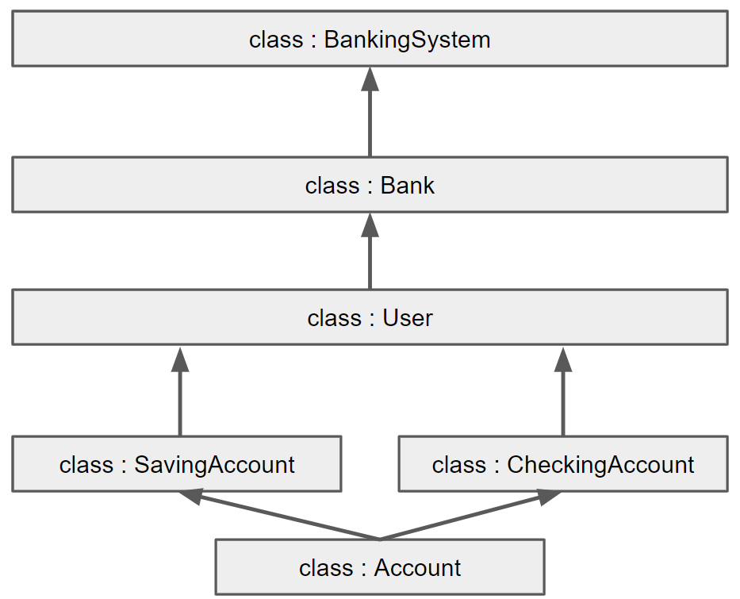

- **セットアップと実行の手順**
    - abcのpackageが必要です
    - main.pyを実行することで，Banking Systemを実行します．

- **プロジェクトにおける重要な設計やその設計理由**
    - クラス図は下記です． 
    

    - オブジェクト志向的な実装を重視し，例えばBankingSystem上での「口座から引き出し処理」は，Bank -> User -> Accountと指示が波及し，Account内で実際の引き出し処理が行われます．

- **このツールまたはサービスの使い方の説明 (ユーザー向けの説明)**
    - ユーザー登録の後，口座登録が必要です．
    - ユーザー登録時，パスワードを設定する必要があります．以降，口座にアクセスするためにはユーザーのID・パスワードの認証が必要です．
    - ユーザーごとの口座番号を手元で記憶してください．（システム側で，ユーザごとの口座一覧を表示する機能は無いです）

